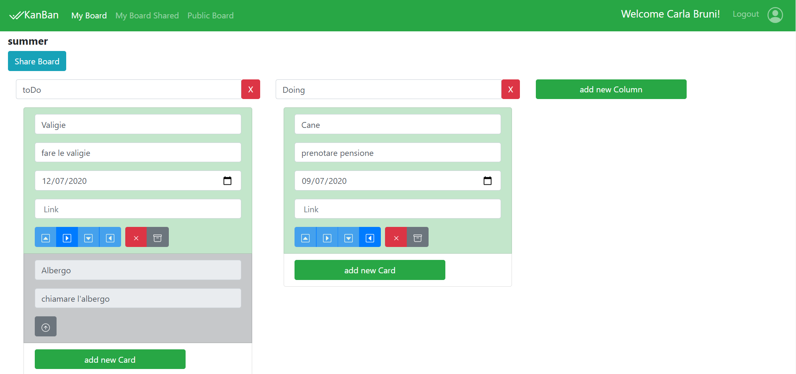

# Exam #13/07/2020: "Kanban"
## Student: s260770 GRIMALDI SIMONE 

## React client application routes

- Route `/`: home page che reindirizza alla login
- Route `/login`: pagina di login
- Route `/public`: pagina di prova per utenti non loggati
- Route `/boards/:id/:name`: pagina della board di id: id e name:name
- Route `/boards`: pagina con tutte le board disponibili all'utente (le sue e quelle condivise con lui)
- Route `/sharedBoardsByMe` : pagina con tutte le board condivise dall'utente
- Route `/sharedBoardsByMe` : pagina di errore dove si viene reindirizzati in caso di errori con il server

## REST API server

- POST `api/login`
  - username e password richiesti nel body
  - response body: restituisce un token di autenticazione e un json con id, username e name
- GET `/api/user`
  - response body content: restituisce un json con id,username e name
- GET `api/board`
  - response body content : restituisce le board dell'utente loggato
- GET `api/sharedBoard`
  - response body content : restituisce le board condivise con l'utente loggato
- GET `api/sharedByUserBoard`
  - response body content : restituisce le board condivise dall'utente loggato
- POST `/api/boards`
  - request body content: riceve nel body la board da inserire a db
  - response body content: ritorna l'id della board appena inserita
- DELETE `/api/boards/:boardId`
  - request parameters: riceve come parametro l'id della board da eliminare
- GET `/api/boardById`
  - request parameters: riceve nell'url l'id della board
  - response body content: restituisce la board richiesta
- GET `/api/columns`
  - request parameters : riceve nell'url l'id della board
  - response body content: restituisce un json con le colonne della board richiesta
- POST `/api/columns`
  - request body content: riceve il json della colonna da inserire
  - response body content: ritorna l'id della colonna appena inserita
- PUT `/api/column/:ColumnId`
  - request parameters: riceve l'id della colonna da aggiornare, request body content: riceve nel body la colonna da aggiornare a db
- DELETE `/api/boards/:columnId`
  - request parameters: riceve come parametro l'id della colonna da eliminare
- GET `/api/cards`
  - request parameters : riceve nell'url l'id della board e l'id della colonna
  - response body content: restituisce un json con le card della colonna richiesta
- POST `/api/cards`
  - request body content: riceve il json della card da inserire
  - response body content: ritorna l'id della card appena inserita
- PUT `/api/column/:CardId`
  - request parameters: riceve l'id della card da aggiornare, request body content: riceve nel body la card da aggiornare a db
- DELETE `/api/boards/:cardId`
  - request parameters: riceve come parametro l'id della card da eliminare
- GET `/api/links`
  - request parameters : riceve nell'url l'id della card 
  - response body content: restituisce un json con i link della card richiesta
- POST `/api/links`
  - request body content: riceve il json del link da inserire
  - response body content: ritorna l'id del link appena inserito
- PUT `/api/link/:LinkId`
  - request parameters: riceve l'id del link da aggiornare, request body content: riceve nel body il link da aggiornare a db
- DELETE `/api/link/:linkId`
  - request parameters: riceve come parametro l'id del link da eliminare
- POST `/api/shareBoard'`
  - request body content: riceve il json dei dati da inserire nella tabella di relazione tra le boards condivise 
  - response body content: ritorna l'id del record appena inserito
- GET `/api/getAllUser`
  - request parameters : riceve nell'url l'id del proprietario della board da condividere
  - response body content: restituisce un json con tutti gli utenti del db tranne il proprietario della board

## Server database

- Table `kanban_t_users` - contains "id" "username" "hash" "name" lista di utenti
- Table `kanban_t_boards` - contains "id" "title" "owner" lista di boards
- Table `kanban_t_cards` - contains "id" "id_board" "title" "description" "id_column" "deadline" "archived" "position" lista di cards
- Table `kanban_t_columns` - contains "id" "id_board" "description" lista di colonne
- Table `kanban_t_links` - contains "id" "id_card" "description" lista di link
- Table `kanban_r_shared` - contains "id" "id_owner" "id_shared" "id_board" tabella di relazione tra utente owner e utente shared

## Main React Components

- `Home` (in `Home.js`): Home page dell'applicativo dove vengono caricate le board dell'utente
- `Board` (in `Board.js`): Pagina della board seleziona dove si possono fare le operazioni sulle card e colonne

## Screenshot

 

## Test users

* utente1, password1
* utente2, password2
* utente3, password3 (utente che ha condiviso board e ha board condivise con lui)
* utente4, password4
* utente5, password5 
